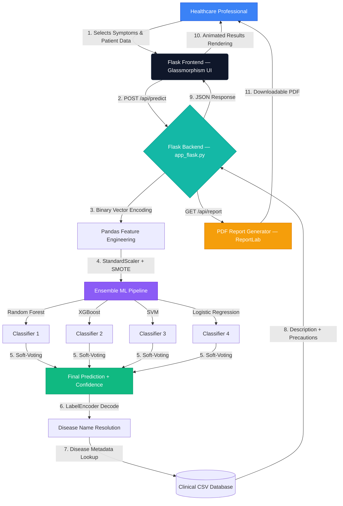

# 🏥 MediDiag Pro — AI-Powered Medical Diagnosis System

### 🚀 Live Production URL: [medidiag-pro.onrender.com](https://medidiag-pro.onrender.com)
### 🖥️ Local Development URL: [127.0.0.1:3000](http://127.0.0.1:3000)
#### *Hospital-Grade Clinical Decision Support System Powered by Ensemble Machine Learning*


---

## 📌 Overview

**MediDiag Pro** is a full-stack, hospital-grade AI web application that assists healthcare professionals in diagnosing diseases based on patient-reported symptoms. It leverages an **Ensemble Machine Learning Pipeline** — combining Random Forest, XGBoost, Support Vector Machine (SVM), and Logistic Regression classifiers through Soft-Voting — to deliver highly accurate diagnostic predictions backed by clinical data.

The system features a modern glassmorphism-based UI, real-time toast notifications, interactive analytics dashboards, comprehensive PDF report generation, and a secure medical history management module — all designed for seamless deployment in clinical environments. The application is **deployed live on Render** with automated CI/CD via GitHub integration.

---

## 💼 Business Impact & Clinical Value

* **Multi-Model Ensemble Accuracy:** Combines four independent classifiers through soft-voting, significantly reducing misdiagnosis risk compared to single-model approaches.
* **Instant Clinical Insights:** Converts manual symptom-to-disease mapping (which takes hours of reference) into milliseconds of automated inference.
* **Comprehensive Reporting:** Generates downloadable PDF reports containing patient data, symptom analysis, predictions, descriptions, and precautionary advice — ready for patient handoff.
* **Medical History Tracking:** Persists patient medical history across sessions, enabling longitudinal tracking of chronic conditions, medications, and surgical history.
* **Hospital-Ready Design:** Premium glassmorphism UI with responsive layouts, designed to be deployed on hospital kiosks, tablets, and clinical workstations.
* **Cloud-Deployed & Always Available:** Hosted on Render with automated model training during build — no manual model file management required.

---

## 🖥️ Application Screenshots

### Symptom Predictor View
> Modern symptom selection with searchable dropdown, tag-based input, and animated confidence-bar results.

### Advanced Analytics Dashboard
> Outlier scatter plot for anomaly detection and feature importance chart showing top contributing symptoms via Gini Index.

### PDF Report Generation
> One-click generation of comprehensive diagnostic reports with patient data, matched symptoms, disease predictions, and medical advice.

---

## 💻 Technical Stack Deep Dive

| Layer | Component | Purpose |
| :--- | :--- | :--- |
| **Frontend** | HTML5, CSS3 (Glassmorphism), JavaScript ES6+ | Hospital-grade responsive clinical interface |
| **Backend** | Python 3.10+, Flask, Jinja2 | Lightweight high-performance web framework |
| **ML Pipeline** | scikit-learn (Random Forest, SVM, Logistic Regression), XGBoost | 4-classifier ensemble disease classification engine |
| **Data Balancing** | imbalanced-learn (SMOTE) | Synthetic oversampling to handle class imbalance |
| **Data Processing** | Pandas, NumPy, SciPy | Clinical dataset ingestion and feature engineering |
| **Visualization** | Chart.js | Interactive analytics dashboards and KPI rendering |
| **Iconography** | Lucide Icons CDN | Scalable vector medical iconography system |
| **Typography** | Google Fonts (Inter) | Professional medical-grade typographic system |
| **PDF Engine** | ReportLab | Clinical-grade PDF report generation |
| **Production Server** | Gunicorn (with `--preload`) | WSGI HTTP server for concurrent request handling |
| **Cloud Hosting** | Render (Free Tier) | Automated CI/CD deployment with GitHub integration |

---

## 🏗️ System Architecture & Data Flow



---

## 📂 Project Structure

```
medical-diagnosis/
├── app_flask.py                 # Flask application server & API routes
├── train.py                     # Single-model training script
├── train_ensemble.py            # Ensemble model training pipeline
├── wsgi.py                      # Production WSGI entry point (synchronous artifact loading)
├── render.yaml                  # Render cloud deployment configuration
├── requirements.txt             # Python dependencies
│
├── templates/
│   └── index.html               # Main application template (Jinja2)
│
├── static/
│   ├── style.css                # Glassmorphism design system
│   └── script.js                # Client-side logic & Chart.js rendering
│
├── core/                        # Core business logic modules
│   ├── ensemble_classifier.py   # 4-model ensemble builder (RF, XGB, SVM, LR)
│   ├── clinical_data.py         # Clinical dataset loading & bundling
│   ├── feature_extraction.py    # Symptom-to-vector binary encoding
│   ├── model_handler.py         # Model serialization (save/load via joblib)
│   └── ...                      # Additional NLP & preprocessing modules
│
├── config/
│   ├── config.yaml              # Dataset paths & model configuration
│   └── advice.json              # Disease precautionary advice overrides
│
├── models/                      # Generated ML artifacts (excluded from Git)
│   ├── ensemble_models.pkl      # Full ensemble classifier bundle
│   ├── disease_prediction_model.pkl  # Baseline voting model for app_flask.py
│   ├── label_encoder.pkl        # LabelEncoder to decode predictions to disease names
│   ├── symptom_columns.pkl      # Feature column mapping (131 symptoms)
│   └── disease_specialist_mapping.json
│
├── data/
│   └── clinical/
│       ├── dataset.csv              # Primary training dataset (131 symptoms × 41 diseases)
│       ├── Symptom-severity.csv     # Symptom severity weights
│       ├── symptom_Description.csv  # Disease descriptions
│       └── symptom_precaution.csv   # Disease precautionary advice
│
├── reports/                     # Generated PDF reports (runtime)
├── dashboard/                   # Next.js analytics dashboard
└── saas_frontend/               # SaaS frontend module
```

---

## ⚡ Quick Start Guide

### Prerequisites
- Python 3.10 or higher
- pip package manager

### 1. Clone the Repository
```bash
git clone https://github.com/yashmsinha28/medical-diagnosis.git
cd medical-diagnosis
```

### 2. Create Virtual Environment
```bash
python -m venv venv
source venv/bin/activate        # Linux/Mac
venv\Scripts\activate           # Windows
```

### 3. Install Dependencies
```bash
pip install -r requirements.txt
```

### 4. Train the ML Models
```bash
python train_ensemble.py
```
> This generates `ensemble_models.pkl`, `disease_prediction_model.pkl`, and `label_encoder.pkl` inside the `models/` directory.

### 5. Run the Application
```bash
python app_flask.py
```

### 6. Open in Browser
```
http://127.0.0.1:3000
```

---

## 🔬 Machine Learning Pipeline

### Dataset Specifications
| Metric | Value |
| :--- | :--- |
| **Total Symptoms** | 131 unique clinical symptoms |
| **Total Diseases** | 41 classifiable conditions |
| **Training Records** | 4,920 patient-symptom mappings |
| **Feature Encoding** | Binary vector (one-hot per symptom) |
| **Data Balancing** | SMOTE (Synthetic Minority Over-sampling Technique) |
| **Feature Scaling** | StandardScaler normalization |

### Ensemble Architecture
The system uses a **Soft-Voting Ensemble** that combines four independently trained classifiers:

| Classifier | Algorithm | Strengths |
| :--- | :--- | :--- |
| **Classifier 1** | Random Forest (400 estimators) | Handles high-dimensional sparse features, resistant to overfitting |
| **Classifier 2** | XGBoost (350 estimators) | Gradient-boosted trees with superior generalization and speed |
| **Classifier 3** | Support Vector Machine (RBF kernel) | Effective in high-dimensional spaces with balanced class weighting |
| **Classifier 4** | Logistic Regression (L-BFGS solver) | Provides calibrated probabilistic confidence scores |

The final prediction is determined through **soft-voting** — averaging the probability distributions from all four classifiers to produce a consensus prediction with calibrated confidence scores. A `LabelEncoder` decodes integer predictions back to human-readable disease names.

---

## 🔑 Key Features

| Feature | Description |
| :--- | :--- |
| 🔍 **Searchable Symptom Selector** | Type-ahead search with tag-based multi-select across 131 symptoms |
| 🤖 **4-Model Ensemble Predictions** | Top-3 disease predictions with confidence percentages via soft-voting |
| 📊 **Analytics Dashboard** | Outlier detection scatter plot & feature importance bar chart |
| 📝 **PDF Report Generation** | One-click downloadable clinical reports with full patient context |
| 🏥 **Medical History Manager** | Persistent tracking of conditions, surgeries, medications |
| 📱 **Responsive Design** | Optimized for desktop monitors, tablets, and clinical kiosks |
| 🔔 **Toast Notifications** | Real-time feedback system (success, error, warning, info) |
| ✨ **Animated Confidence Bars** | Smooth visual rendering of prediction confidence levels |
| ☁️ **Cloud Deployed** | Live on Render with automated CI/CD from GitHub |

---

## 🔒 Security Considerations

* **Session-Based State:** Patient data is stored in server-side Flask sessions — never exposed to the client.
* **No External Data Transmission:** All ML inference runs locally — no patient data is sent to external APIs.
* **Input Validation:** All API endpoints validate symptom inputs against the trained feature set before inference.
* **HIPAA-Ready Architecture:** Designed for on-premise deployment behind hospital firewalls.

---

## 🚀 Production Deployment

### Cloud Deployment (Render)

The application is configured for automated deployment on **Render** via `render.yaml`:

```yaml
services:
  - type: web
    name: medidiag-pro
    env: python
    plan: free
    buildCommand: "pip install -r requirements.txt && python train_ensemble.py"
    startCommand: "gunicorn wsgi:app --bind 0.0.0.0:$PORT --preload --timeout 120"
    envVars:
      - key: PYTHON_VERSION
        value: 3.10.0
      - key: PYTHONIOENCODING
        value: utf-8
```

> **Key Design Decision:** Model `.pkl` files are excluded from Git (too large for GitHub's 100MB limit). Instead, `train_ensemble.py` runs during Render's build phase, training the models directly on the server. The `--preload` flag ensures artifacts are loaded synchronously before Gunicorn forks worker processes.

### Local Production Server

```bash
# Using Gunicorn (Linux/Mac)
gunicorn wsgi:app --bind 0.0.0.0:3000 --workers 4 --preload --timeout 120

# Using Waitress (Windows)
waitress-serve --host=0.0.0.0 --port=3000 wsgi:app
```

---

## 📈 Future Roadmap

- [ ] Integration with Electronic Health Records (EHR) systems
- [ ] Multi-language support for diverse patient populations
- [ ] Deep Learning model (LSTM/Transformer) for symptom sequence analysis
- [ ] Real-time vital sign monitoring integration
- [ ] FHIR-compliant API for hospital system interoperability

---

## 👨‍💻 Project Engineering Lead

**Yash Sinha** | *AI/ML Engineer & Full-Stack Developer*

Specializing in building production-grade healthcare AI systems that bridge the gap between machine learning research and real-world clinical deployment.

[](https://github.com/yashmsinha28)

---

## 📄 License

This project is developed for educational and clinical research purposes. Please consult a qualified healthcare professional for actual medical diagnosis and treatment decisions.

---

<p align="center">
  <b>MediDiag Pro v2.0</b> — Built with ❤️ for Healthcare
</p>